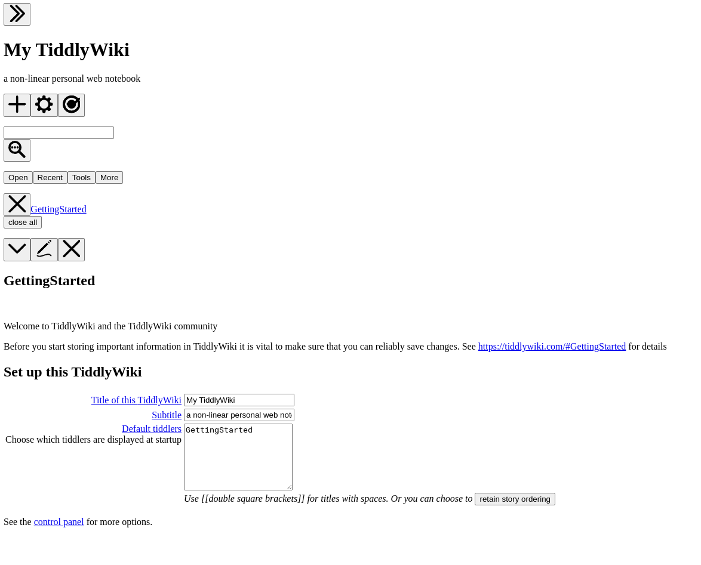

# TiddlyWiki5 on FlyIO


---


## Installation

- Please first complete [`README.md`](../README.md)


---


## Deploy a Wiki

- Configure `fly` via configuration `fly.toml`

```sh
cp example.fly.toml fly.toml
```

- Run ...

```sh
fly launch --no-deploy
```

... and accept the option to **"tweak the settings before proceeding"** to edit the configuration & change the domain name etc.

- Deploy

```sh
fly deploy
```

You should see -




> [!NOTE]
> This `TiddlyWiki` setup stores tiddlers as one file on disk per tiddler.
> By default, `Fly` apps do not store files so every time the app restarts all tiddlers are lost.
> To persist files, `Fly` recommends using either "volumes" or "object storage".
> We're going to use "volumes" here.

- Create an empty Wiki locally

```sh
npx tiddlywiki ./tiddlers --init server
```

Or [convert a pre-existing single `html` file to `Node`](https://talk.tiddlywiki.org/t/migration-from-single-html-file-to-node-js/3585)

```sh
tiddlywiki --load ./mywiki.html --savewikifolder ./tiddlers
```

- Create a volume on the app

If we specify ...

```toml
[[mounts]]
  source = 'tiddlywiki_data'
  destination = '/data'
```

... in `fly.toml` then `Fly` creates a new folder `/data` **after the app has been deployed**

- Copy the Wiki to the `fly` app

If we want to copy our tiddlers to the app we can ...

... zip the tiddlers into a tarbell & copy it to the remote app via `sftp` ...

```sh
tar -cf tiddlers.tar tiddlers/
fly ssh sftp shell
put tiddlers.tar /data/tiddlers.tar
```

... connect to the remote app via `ssh` & unzip the tarbell ...

```sh
fly ssh console
cd /data
tar -xf tiddlers.tar
rm tiddlers.tar
```

`Fly` will automatically backs up this volume via snapshots


---


## Extras

### Add authentication

Create secrets (or environment variables) on the server ...

```sh
fly secrets set TWUSER="<username>"
fly secrets set TWPASS="<password>"
```

> [!NOTE]
> The `Dockerfile` startup command `node tiddlywiki.js /path/to/tiddlers --listen ...` instructs the `Node` server to use the environment variables `TWUSER` & `TWPASS` as credentials. Changing either environment variable will update the credentials.

### Install plugins

The `tiddlyweb` & `filesystem` plugins aren't installed by default in the empty wiki.

I had to `sftp` to the server & link `/data/tiddlers/tiddlywiki.info` to `/data/tiddlers/plugins/tiddlywiki/tiddlyweb` & `/data/tiddlers/plugins/tiddlywiki/filesystem` via `{ "plugins": [ "tiddlywiki/filesystem", "tiddlywiki/tiddlyweb" ] }` 

### Auto-stop the server when idle

Just add ...

```toml
[http_service]
  ...
  auto_stop_machines = true
  auto_start_machines = true
```

... to `fly.toml`

> [!WARNING]
> Auto-stop may prevent you from connecting to the remote app via `sftp` or `ssh`, so you may have to turn this off before making these connections.


---


## Gotchas

### Tiddlers not saving

The `tiddlyweb` & `filesystem` plugins aren't installed by default in the empty wiki.

See [Install plugins](#install-plugins) for a guide!


---


## Local

- Launch a server

```sh
npx tiddlywiki ./TiddlyWiki5/editions/empty --listen
```


---


## Tutorials

- [`JavaScript` on `Fly.io`](https://fly.io/docs/js/)
- [Add volume storage to a Fly Launch app](https://fly.io/docs/launch/volume-storage/) - to persist tiddlers on disk
- [Install a `TiddlyWiki` plugin](https://tiddlywiki.com/#Installing%20custom%20plugins%20on%20Node.js)
